# 👋 Hi, I'm Linghao Zhang

---

## 🧑‍💻 About Me

- 🎓 Senior at **Shanghai Jiao Tong University (SJTU)**, incoming graduate student at SJTU
- 🏢 Intern at **ZTE**, working on speech model research, including TTS and end-to-end speech models
- 🔬 Conducting research on **password security** at SJTU
- 🤖 Currently exploring **AI Agents**
- 📫 Reach me at [**lh.zhang.work@gmail.com**](mailto:lh.zhang.work@gmail.com)

---

## 📊 GitHub Stats

  
  

  

---

## 🐍 Contribution Snake

  <picture>
    <source
      media="(prefers-color-scheme: dark)"
      srcset="https://raw.githubusercontent.com/zlh123123/zlh123123/output/github-snake-dark.svg"
    />
    <source
      media="(prefers-color-scheme: light)"
      srcset="https://raw.githubusercontent.com/zlh123123/zlh123123/output/github-snake.svg"
    />
    
  </picture>

---

## 🏆 GitHub Trophies

  

---

